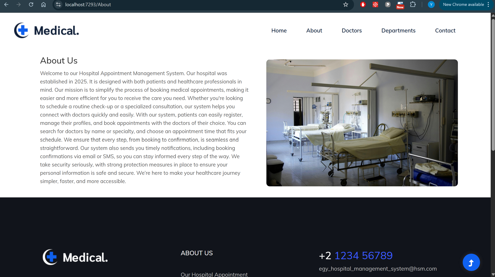
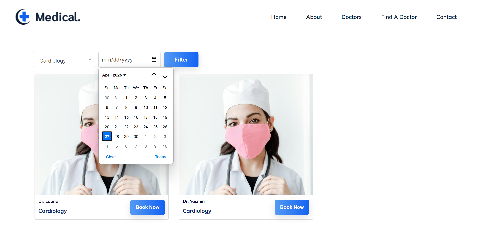
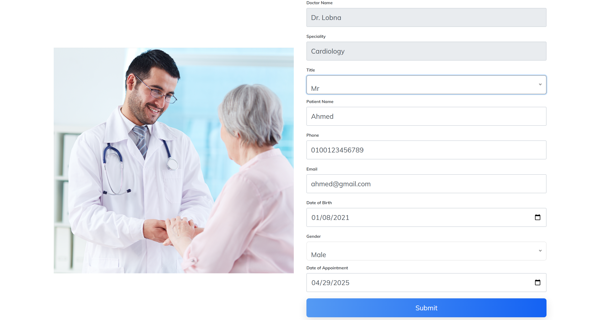
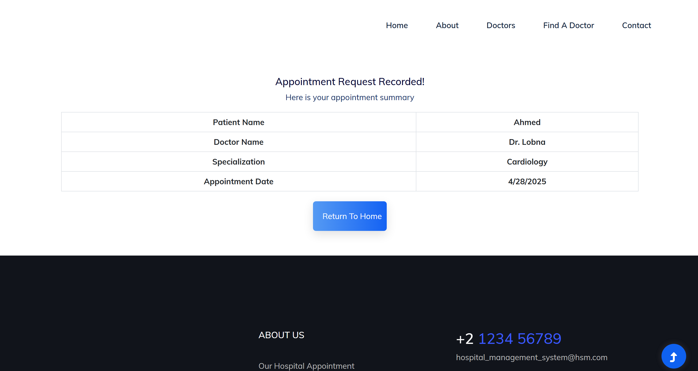
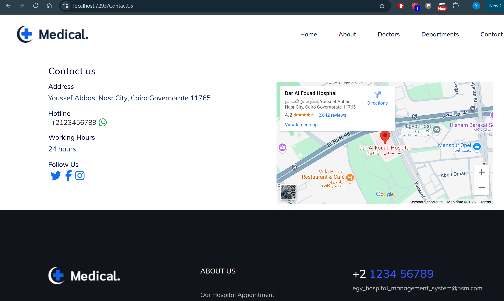

# Hospital Management System


## Overview

Hospital Management System aims to provide an integrated solution in the form of a dashboard for managing and 
organizing hospital and clinic appointment bookings. It enables patients to book examination 
appointments easily while considering doctors' availability, schedules, personal data, and medical 
records.

[View SRS](https://drive.google.com/file/d/1wk3222iME_vjVctWEKHFpHwg9WxJeoYU/view?usp=drive_link)

[View ERD](https://drive.google.com/file/d/1Y0kTyGLfvSNKoXLljpFP7mjZotg-aC9e/view?usp=sharing)

[Download Wireframe](https://drive.google.com/file/d/1WJTppyhXQu0Ptw8IZ94PT0WBOFfp4G1a/view?usp=drive_link)


## Features
- A Departments page that lists all the available clinics in the hospital.
- In the Departments page, there are some filters that help users to find doctors according to clinic and/or suitable date.
- In the Departments page, user can book an appointment.
- About page that show the history of the hospital.
- Contact us page which show the address of the hospital, its phone number and direct link to communicate over WhatsApp,
the working hours, direct links to the hospital social media accounts, and an embedded Google Maps location.
- In Areas of Admin, There are many CRUD (Insert and Edit) operations of(Patients/Doctors/Departments) and Dashboard 


## In Progress
- Point 1.
- Point 2.


## Application









## Components

### Home
- Description.

### Page 2
- Description.

### Page 3
- Description.


## Project Dependencies

- [Depedency 1](Dependency URL) description.
- [Depedency 2](Dependency URL) description.


## Project Structure
```
HospitalManagementSystem/ 
	├── HospitalManagementSystem.Presentation/
	│	├── Areas/ 	
	│	├── Controllers/ 	
	│	├── ViewModels/ 	
	│	├── Views/ 		
	├── HospitalManagementSystem.Services/
	│	├── Helpers/ 	
	│	├── Services/
	│	│	├── Interfaces/  		
	├── HospitalManagementSystem.Data/
	│	├── Migrations/ 	
	│	├── Repositories/
	│   │	├── Interfaces/
	│   │   ├── GenericRepository.cs
	│	├── ApplicationDbContext.cs	
	├── HospitalManagementSystem.Models/ 
	│	├── Appointments/ 	
	│	├── Contacts/ 	
	│	├── Doctors/ 	
	│	├── Patients/
	│	├── Users/
	│	├── Enums/
```
## Getting Started

### Prerequisites

- Required steps, if any.

### Installation

1. Clone the repository:
   git clone https://github.com/NohaGhattas/.Net-hospital-project-.git

2. Step 2

3. Step 3
   
### License

- This project is licensed under the MIT License. See the LICENSE file for details.

## Acknowledgements

- [Ack](url) description.

- 

